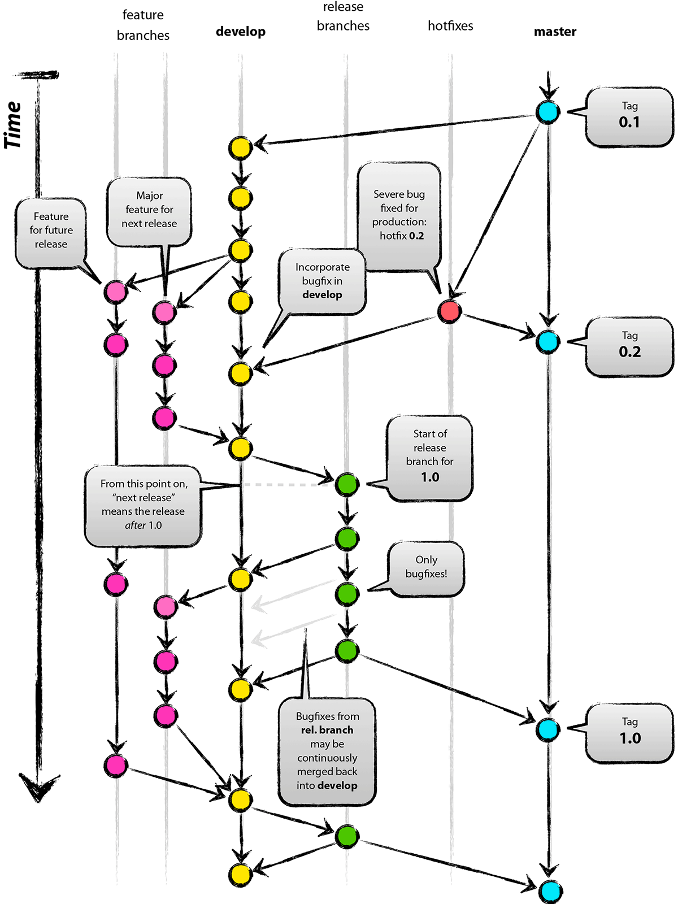

版本控制系统。
集中式版本控制系统：SVN，所有文件都保存在中央服务器，其他电脑上保存的都是副本，修改时需要从中央服务器下载最新版本，修改内容，修改完成后就上传回中央服务器。
缺点：如果中央服务器炸了，其他就全没了。

分布式版本控制系统：
每台电脑上都有完整的项目，当需要把项目修改同步给他人时，只需把仓库同步一下就行。

## Git安装和配置
### 安装
直接去官网安装重装系统对应的版本就行。

我选择的全部是默认的安装选项。
### 初始配置
使用Git之前，用`git config`配置一下用户名和邮箱
--global是全局配置
```bash
输入用户名和邮箱
git config --global user.name "Changersh"
git config --global user.email 1527953838@qq.com

保存用户名和密码
git config --global credential.helper store
查看配置信息
git config --global --list
```
## 基本操作
### git init 新建仓库
版本库，即仓库。
创建仓库：
 用git的命令行创建仓库：（在git bash中操作）
 ```bash
 创建一个文件夹
 mkdir learn-git
 进入文件夹
 cd learn-git
 
 初始化仓库
 git init
 ```

git clone 从GitHub或者gitee获取远程仓库
```bash
git clone https://gitcode.com/Changersh/SourceTree-Test.git
```
### git add 添加和git commit 提交文件
查看仓库状态，查看当前仓库所处分支，有哪些文件，这些文件的状态
```bash
git status
```

为了测试，这里随便创建一个文件：`echo "这是第一个文件hhh" > file1.txt`

添加文件到暂存区
```bash
git add file1.txt

支持通配符
git add *.txt 提交所有.txt 后缀的文件

添加当前目录下所有文件到暂存区
git add .
```
如下图，发现“红色“的文件，已经变成了”绿色“，表示这个文件已经被添加到了暂存区

上面还提示我们取消暂存的命令
```bash
git rm --cached file1.txt
```
将暂存区中的文件提交到本地仓库
git提交的时候只会提交暂存区的内容，不会提交其他的内容
```bash
git commit -m "提交信息，一般是一些备注，表面这次为啥更新之类的"

如果此文件已经被add过，使用这个命令可以同时完成 add和commit两个操作
git commit -a -m "xxxxx"
```
### git log 查看提交记录
```bash
git log

git log --oneline 查看简洁的提交记录

查看分支情况（比较形象的）
git log --oneline --graph --decorate --all
```

### git reset 回退版本
`git reset --soft`
回退到某一版本，保存工作区和暂存区全部内容
`git reset --hard`
回退到某一版本，丢弃工作区和暂存区全部内容
`git reset --mixed`
回退到某一版本，只保留工作区的内容，丢弃暂存区内容。

mixed是reset命令的默认参数
回退到上一个版本：`git reset HEAD^` 这里的HEAD^就是回退到上一版本的意思
回退到指定版本：`git reset 指定版本的版本号`，版本号使用`git log`命令可以查看

查看暂存区内容：`git ls-files`
### git diff 查看差异
1、查看文件在工作区、暂存区、本地仓库之间的差异
`git diff`默认是看工作区和暂存区的差异
`git diff HEAD`，比较工作区和暂存区的差异
`git diff --cached`，比较暂存区和版本库的差异

2、查看不同版本之间的差异
`git diff 版本1的ID 版本2ID`
`git diff HEAD~ HEAD`比较当前版本(`HEAD`)和上一版本(`HEAD~`，波浪线~、尖角^都一样)
	波浪线后可以加数字，代表`HEAD`之前的第n个版本
`git diff HEAD~ HEAD 文件名` 代表这个文件在不同提交版本中的差异

3、查看不同分支之间的差异

### git rm 删除文件
第一种方法：
先用你所在操作系统的方法，手动删除某个本地文件，如果暂存区中之前add了该文件，要再次进行`git add .`更新一下暂存区，把这个文件刷掉
这样很麻烦，是两步：删除文件，更新暂存区

第二种方法：
`git rm 文件名`
文件会同时从**工作区**和**暂存区**被删除

最后记得提交`git commit`，更新本地仓库的内容

只删除版本库中文件，不删除本地文件：加上`--cached`参数。`git rm --cached xxxxx`
## 相关知识
### 工作区域和文件状态
#### 工作区域
工作区（Working Directory）
- 实际操作的目录，`.git`所在地目录
暂存区（Staging Area/Index）
- 中间区域，临时存放即将提交的修改内容，`.git/index`
本地仓库（Local Repository）
- Git存储代码和版本信息的主要位置，`.git/objects`

把工作区修改后的内容提交到**暂存区**（git add），然后提交到**本地仓库**（git commit）

#### 文件状态
未跟踪（Untrack）
- 新创建的还没被git管理的文件
未修改（Unmodified）
- 已经被git管理，但内容没变化
已修改（Modified）
- 已修改过但没添加到暂存区
已暂存（Staged）
- 修改后，已经添加到暂存区


### .gitignore 忽略文件
此文件**作用**：忽略掉一些不该被加入到版本库中的文件

哪些文件不应该被纳入呢？
1、系统或软件自动生成的文件
- 一些工具或软件产生的临时文件
2、编译产生的中间文件和结果文件
- 如果一个文件是通过另一个文件自动生成的，自动生成的这个文件就没必要放在版本库中
- 比如Java编译生成的：.class文件
- C语言编译生成的：.o文件
3、系统运行过程中自动生成的一些文件，如日志文件、缓存文件或临时文件等。
4、设计身份、密码、口令、密钥等敏感信息文件

==让`.gitignore`生效：把这个文件add之后commit就行了。==
#### 如何过滤掉应该被忽略的文件？
会有一个`.gitignore`文件，我们往里面写入要过滤的文件名即可
```bash
忽略所有日志文件
*.log

忽略根目录下的文件夹（一定要用 斜杠 / 结尾）
temp/
```

==注意：`.gitignore`对已经`git add`添加到缓存区，或者`git commit`提交到版本库的文件不生效==

#### .gitignore文件的匹配规则
从上到下，逐行匹配，每一行表示一个忽略模式
官网匹配规则：https://git-scm.com/docs/gitignore

- 空行或以`#`开头的行会被忽略。#一般用作注释
- 使用标准的Blob模式匹配
	- 就是简化的正则，`*`代表任意个字符，问号`?`匹配单个字符，中括号`[]`匹配列表中的单个字符，
	- `[abc]`，表示a/b/c
- 两个星号`**`表示匹配任意的中间目录
- 中括号可以使用短中线连接
	- `[0-9]`，任意一个数字
	- `[a-z]`，任意一位小写字母
- 感叹号`!`表示取反

关于目录的：
- `/todo`，表示忽略当前目录下的todo文件，不忽略子目录下的todo文件
- `build/`，忽略任何目录下的build文件夹
- `doc/*.txt`，忽略doc目录下的txt文件，不会忽略doc子目录下的txt文件
- `doc/**.txt`，忽略doc目录及其所有子目录下的txt文件
### 分支简介
分支可以让多个开发者使用，每个开发组如果是不同的任务，比如测试、开发等。使用不同的分支，最后合并到main主分支上，以保证主分支项目的稳定性。

#### 分支命令
`git branch` 查看分支
`git branch -d xxx` 删除xxx分支（如果某分支已经被合并了，直接删除就行）==如果分支没有被合并过，不能被这样删除==
	需要使用：`git branch -D xxx` 强制删除
`git branch -M main`,切换成main，现在都用这个，不用Windows的Git Bash中默认的master了
`git branch xxx` 创建分支
`git checkout xxx`切换分支
	这个命令还会用来恢复文件或目录到之前的某个状态。
	如果此时文件名和分支名相同，会默认进行切换分支，有歧义。
`git switch xxx`切换分支，官方随后推出了这个命令，最好是用这个

`git merge 将要被合并的分支` 合并xxx分支到当前所在分支
（分支被合并不会被删除，只是内容被合并到了另外的分支

`git checkout -b dev 8808ebd版本号` 当dev已经被删除了，恢复dev，并恢复到指定的版本
#### 合并分支冲突
一般情况下，两个分支没有重合的修改，自动会合并。
但如果两个分支修改了同一个文件的同一行代码，git就不能自动处理了。

 产生合并冲突后，可以使用`git diff`命令查看冲突的具体内容，会显示出两个分支的修改内容
 如下图，冲突的部分会自动写到这个文件中，我们手动处理即可。

修改好后，再次进行add和commit，然后就**自动** 完成了合并的操作

提交之前想中断合并：`git merge --abort`

#### rebase变基合并分支
`git rebase xxx`
把当前分支，从和目标分支的“分叉”开始，全部合并到目标分支的末尾

如下图，如果是在dev上进行rebase操作，会把main和dev分叉的地方分开，把dev的部分合并到main的末尾

另一种情况，把main合并到dev上
相当于从main3开始，主分支变成了dev，main45就相当于另一个分支，就合并到dev后面


#### Merge和Rebase对比
merge
- 优点：不会破坏原分支的提交历史，方便回溯和查看
- 缺点：会产生额外的提交节点，分支图比较复杂
Rebase
- 优点：不会新增额外的提交记录，形成线性历史，直观、干净。
- 缺点：会改变提交历史，改变了当前分支branch out的节点。
	- 要避免在共享分支中使用。
## 远程仓库
### 注册账号
Github、Gitee、GitLab
这个自己去注册

下面是Github的SSH配置，Gitee和GitLab基本相同的。配置好密钥，正常使用即可。
### SSH配置
使用Http方式需要验证账号密码，这个比较麻烦，也不安全
SSH方式是官方所推荐的，需要有SSH密钥，这样更安全

首先创建一个新的仓库，在本地用SSH方式进行克隆
`git clone git@github.com:Changersh1120/remote-repo.git`
发现报错了：
因为缺少SSH密钥配置


#### 如何生成SSH密钥配置？
1、`cd`进入根目录
2、`cd .ssh`
3、`ssh-keygen -t rsa -b 4096`，然后回车
	-t 指定协议为 rsa
	-b 指定生成的大小为4096
4、如果是第一次生成，直接回车就行，会在用户根目录的SSH目录下生成一个`id_rsa`密钥文件

如果你已经有密钥文件，这里不要回车，输入你自定义的文件名，回车，然后输入自定义密码即可（因为这里会覆盖掉之前的密钥，且不可逆）
之后会生成两个文件：

cat一下，复制公钥的内容，到Github
点击头像->Settings->SSH and GPG keys->New SSH key
然后把刚才复制的公钥输入进去。
标题任意，其他不变，Add SSH key即可

如果是第一次进行密钥配置，到这里就结束了。但如果是之前配置过，这里又创建了一个新的密钥，下面要额外进行配置。
1、创建一个config文件(在 根目录下 .ssh 目录下)
	`vi config`
2、输入下面的内容
当我们访问 github.com时，自动使用 .ssh下的test密钥
```bash
# github
Host github.com
HostName github.com
PreferredAuthentications publickey
IdentityFile ~/.ssh/test
```


此时重新cd到之前的目录，再次进行最开始的`git clone git@github.com:Changersh1120/remote-repo.git`命令
让我们输入密码，如果是第一次生成密钥，你直接回车的，那就不用输入密码了
如果是另外创建了一个密钥，输入你设置的密码
发现，克隆成功了

进入这个仓库进行创建文件，add、commit提交到本地仓库，Github的远程仓库还没有更新，这俩是两个仓库。
git push 到远程仓库中，可以看到远程仓库更新了。

### push推送和pull拉取（从远程仓库拉取 pull）
进入这个仓库进行创建文件，add、commit提交到本地仓库，Github的远程仓库还没有更新，这俩是两个仓库。

我们需要用 git push和 git pull来把这两个仓库进行关联。

`git pull <远程仓库名> <远程分支名>:<本地分支名>`
也可以全部省略,`git pull`，默认是远程和本地分支名都是main，远程仓库别名为origin


执行完 `git pull`后，Git会自动执行一次合并操作，如果远程仓库的操作和本地没有冲突就合并，有冲突就失败，手动合并
`git fetch` 获取远程仓库的修改，不会自动合并，需要手动处理

### 本地仓库上传到空白的远程仓库（push）
1、首先在Github创建一个空白仓库 first-repo
2、之前我们创建了一个本地仓库（git init命令讲解的部分，我是learn-git 目录作为仓库的）
	我们就把 本地的 learn-git 和刚才在Github创建的 first-repo 关联起来

3、新建的空白仓库已经提示我们相关命令

添加一个远程仓库，origin是远程仓库的默认别名，我们可以指定其他名字
```bash
git remote add origin git@github.com:Changersh1120/first-repo.git
```
查看当前仓库对应的远程仓库的地址和别名：`git remote -v`
指定分支为main：`git branch -M main`
把本地仓库的main和远程仓库的main关联起来：`git push -u origin main`
	这个命令其实是：`git push -u origin main:main`
	origin是远程仓库别名
	第一个main是本地的分支，第二个main是远程仓库的分支
	`git push <远程主机名> <本地分支名>:<远程分支名>`

上面命令执行完，就推送到了远程仓库。

### GitLab的私有化部署
Windows可以用docker desktop部署，具体看官方文档吧，一般人是不需要的。

稍微写一下过程：
部署好后，创建一个仓库，git clone一下就可以把远程的拉取下来
git remote add 给本地仓库关联一个远程仓库

## GUI工具
Github Desktop，只能管理Github的内容
SourceTree，免费的GUI
### SourceTree
在APP中进行配置，选择我们前面生成好的密钥文件
工具->选项->一般->SSH客户端配置

### VSCode中使用Git
可以把我们前面使用的本地仓库目录用VSCode打开，进行一些本地修改后，下面的分支图标就会显示更改的文件数

然后就可以进行相关操作，更可视化
下面的提交按钮，可以提交到本地仓库，提交后会变化，让你推送到远程仓库
并且自动使用我们配置好的SSH设置，仍然需要手动输入密码


## 工作流模型
分支命名：使用带有意义的描述性名称来命名分支
- 版本发布分支/Tag示例：v1.0.0
- 功能分支示例：feature-login-page
- 修复分支示例：hotfix-#issueid-desc
分支管理
- 定期合并已经成功验证的分支，及时删除已经合并的分支
- 保持合适的分支数量
- 为分支设置合适的管理权限
### GitFlow模型
具体可看网络介绍，这个分支太多太麻烦了
[Git Flow | 菜鸟教程 - https://www.runoob.com/](https://www.runoob.com/git/git-flow.html)

### Github Flow模型
比GitFlow简单，只有一个长期存在的主分支，主分支上的代码是可以部署到生产环境中的。
